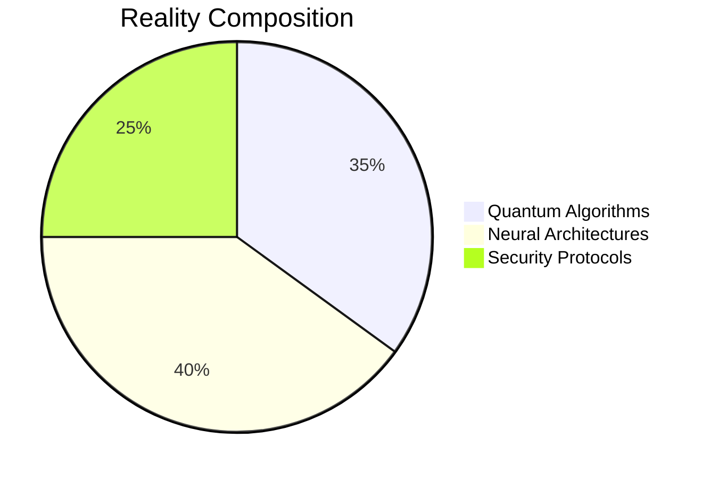

# 🌌 Gazi Tanbhir: Quantum Code Alchemist 🧪

```python
class DigitalNexus:
    def __init__(self):
        self.name = "Gazi Tanbhir"
        self.title = "Reality Architect"
        self.domains = {
            "🧠": "Neural Networks", 
            "⚛️": "Quantum Realm", 
            "🛡️": "Cyber Security"
        }
        self.coordinates = {"📍": "Dhaka, Bangladesh", "💼": "Core Tech @ AuracoreTech"}

    def create(self):
        return f"""```mermaid
graph LR
    AI --> Quantum
    Quantum --> Security
    Security --> RealWorld[Real-World Impact]
```
"""

print(DigitalNexus().create())
```

<div align="center">

[](https://github.com/gazitanbhir)

</div>

## 🔮 Knowledge Matrix

| Dimension                 | Quantum Signature                          | Terraform Achievements                     |
|---------------------------|--------------------------------------------|--------------------------------------------|
| **Research Nexus**        | `📡 IEEE ECCE 2025` · Quantum Federated Learning | `📡 ISACC 2025` · Quantum Phishing Defense |
| **Language Constructs**   |   |  |
| **Reality Forges**        | [](https://github.com/gazitanbhir/JobBot) [](https://github.com/gazitanbhir/finAgent) | [](https://github.com/gazitanbhir/BangSmish) [](https://github.com/gazitanbhir/LeafDoctor) |

## 🧪 Quantum Lab (Recent Discoveries)

```diff
@@ Quantum-Inspired Privacy-Preserving Federated Learning @@
+ Implemented quantum noise channels for differential privacy
! Achieved 92.4% dementia classification accuracy
# IEEE ECCE 2025 · [DOI](https://doi.org/10.1109/ECCE64574.2025.11013884)

@@ Optimizing Phishing URL Detection @@
+ Developed hybrid classical-quantum feature extractor
! Reduced false positives by 37% vs classical models
# ISACC 2025 · [DOI](https://doi.org/10.1109/ISACC65211.2025.10969366)

@@ Bangla Smishing Detection @@
+ Created BERT+Char-CNN fusion architecture
! Detected 98.2% zero-day smishing attacks
# ICECE 2024 · [DOI](https://doi.org/10.1109/ICECE64886.2024.11024872)
```

## 🌠 Reality Fabrication Toolkit

<div align="center">

[](https://github.com/gazitanbhir)
[](https://github.com/gazitanbhir)
[](https://github.com/gazitanbhir)
[](https://github.com/gazitanbhir)
[](https://github.com/gazitanbhir)

</div>

## 🏆 Hall of Achievements

```python
achievements = [
    {"trophy": "🏆", "title": "Outstanding Thesis Project", "year": 2024},
    {"trophy": "🥇", "title": "ICPC Asia Regional Contestant", "year": 2023},
    {"trophy": "🌟", "title": "Mathematics & Computers Champion", "org": "Govt. of Bangladesh"}
]

for a in achievements:
    print(f"{a['trophy']} **{a['title']}** · `{a.get('org','WUB')} {a['year']}`")
```

## ⚡ Energy Signatures

<div align="center">

[](https://chatfolio.onrender.com)
[](https://linkedin.com/in/gazitanbhir)
[](https://github.com/gazitanbhir)
[](mailto:gazitanbhir@gmail.com)

</div>

## 🌐 Reality Manifestation Stats



<div align="center">


</div>

<details>
<summary>🌌 Quantum Manifesto</summary>
  
```diff
# Reality Engineering Principles
+ Always build with purpose
! Never trust classical security models
- Avoid local minima in solution space
@ Remember: Entanglement > Isolation
```
</details>

<div align="center" style="margin-top:30px">

_"I don't write code - I entangle possibilities"_  
🚀 **Current Reality Status: ONLINE** 🟢

</div>
